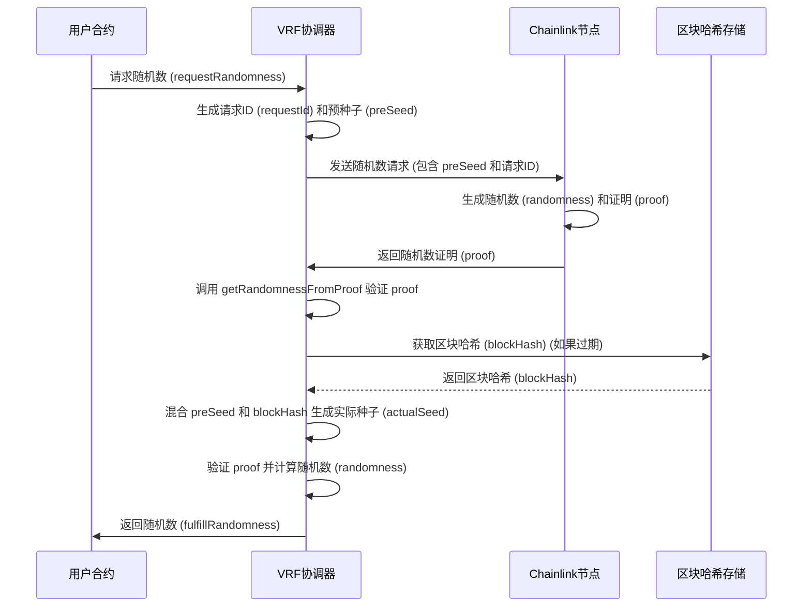

```mermaid
sequenceDiagram
    participant UserContract as 用户合约
    participant VRFCoordinator as VRF协调器
    participant ChainlinkNode as Chainlink节点
    participant BlockHashStore as 区块哈希存储

    UserContract->>VRFCoordinator: 请求随机数 (requestRandomness)
    VRFCoordinator->>VRFCoordinator: 生成请求ID (requestId) 和预种子 (preSeed)
    VRFCoordinator->>ChainlinkNode: 发送随机数请求 (包含 preSeed 和请求ID)
    
    ChainlinkNode->>ChainlinkNode: 生成随机数 (randomness) 和证明 (proof)
    ChainlinkNode->>VRFCoordinator: 返回随机数证明 (proof)

    VRFCoordinator->>VRFCoordinator: 调用 getRandomnessFromProof 验证 proof
    VRFCoordinator->>BlockHashStore: 获取区块哈希 (blockHash) (如果过期)
    BlockHashStore-->>VRFCoordinator: 返回区块哈希 (blockHash)

    VRFCoordinator->>VRFCoordinator: 混合 preSeed 和 blockHash 生成实际种子 (actualSeed)
    VRFCoordinator->>VRFCoordinator: 验证 proof 并计算随机数 (randomness)
    VRFCoordinator->>UserContract: 返回随机数 (fulfillRandomness)
```